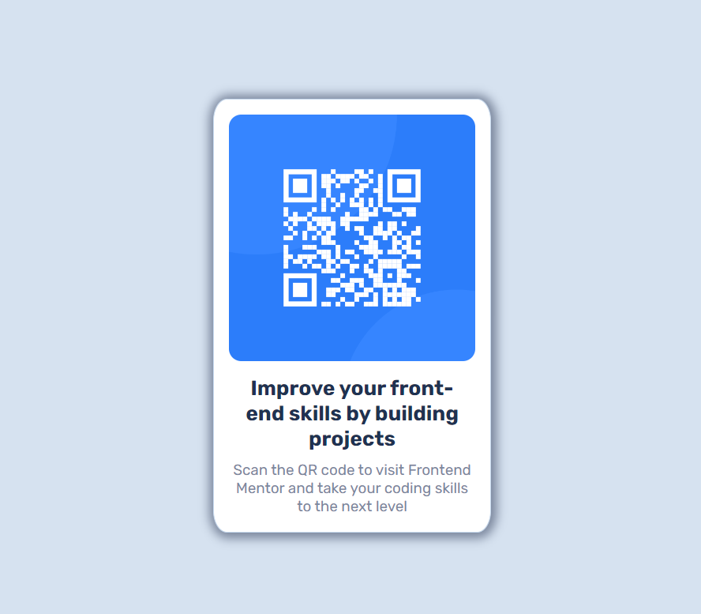

# Frontend Mentor - QR code component solution

This is a solution to the [QR code component challenge on Frontend Mentor](https://www.frontendmentor.io/challenges/qr-code-component-iux_sIO_H). Frontend Mentor challenges help you improve your coding skills by building realistic projects. 

## Table of contents

- [Overview](#overview)
  - [The challenge](#the-challenge)
  - [Screenshot](#screenshot) 
  - [Links](#links)
- [My process](#my-process)
  - [Built with](#built-with)
  - [What I learned](#what-i-learned)
  - [Continued development](#continued-development)
  - [Useful resources](#useful-resources)
- [Author](#author)

## Overview

### The Challenge
Create a Responsive QR code component

### Screenshot

### Links
- Live Site URL: [Preview live site](https://imabhijeet.github.io/QRcode_Component/)

## My process

### Built with
- Semantic HTML5 markup
- CSS custom properties
- Flexbox
- CSS Grid and media queries
- Desktop-first workflow

### What I learned

While working on this project, I refreshed my knowledge of HTML5 and CSS3. I brushed up on concepts like flexbox, grid for creating flexible layouts, simplifying the alignment and distribution of elements within the container. I utilized media queries to craft responsive and user-friendly designs for the project. Additionally, I learned about some new CSS properties that I had heard of before but didn't know how to apply in real-world projects.

### Continued development
I struggled a bit to center the container element but I manage to solve this problem on my own

### Useful resources
- [MDN Web Docs](https://developer.mozilla.org/en-US/)
- [The Odin Project](https://www.theodinproject.com/)

## Author
- LinkedIn - [Abhijeet Sharma](https://www.linkedin.com/in/abhijeet-sharma-994064227/)
- Frontend Mentor - [@imabhijeet](https://www.frontendmentor.io/profile/imabhijeet)
- Twitter - [@cosmicDev12](https://twitter.com/cosmicDev12)
- Behance - [Abhijeet](https://www.behance.net/abhijeetsharma17)

